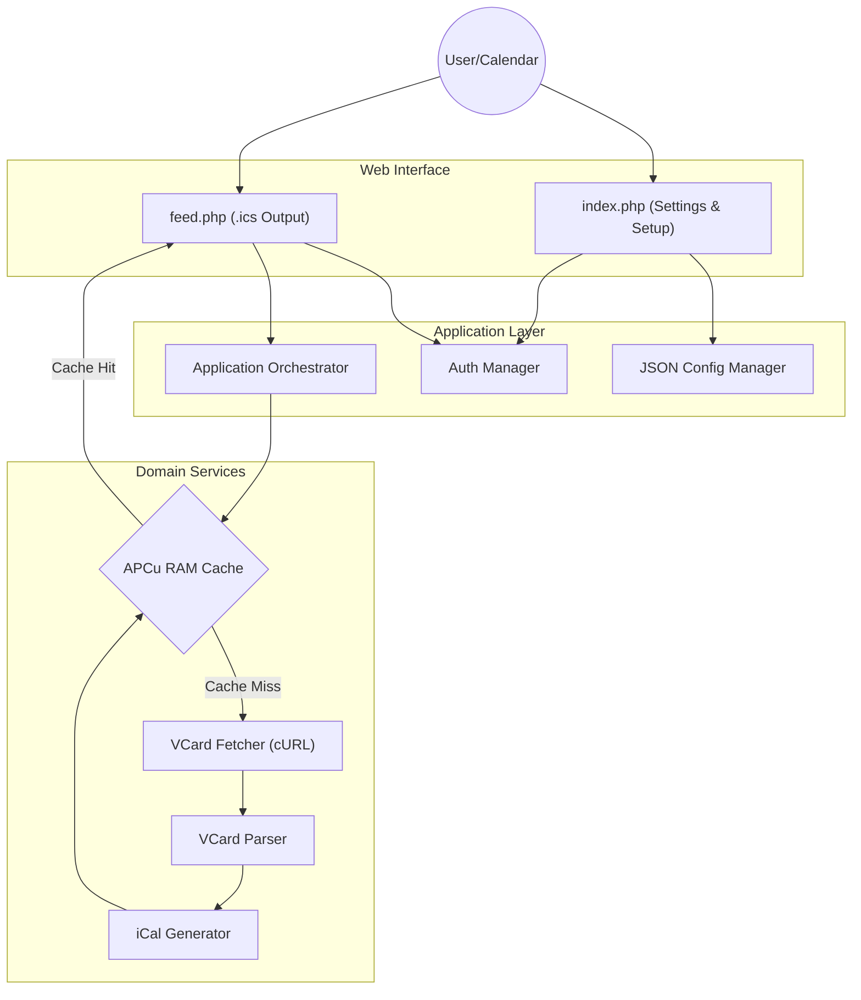

# PHP Birthday 🎂


-lightgrey)


**PHP Birthday** is a high-performance, privacy-first web engine that bridges your contacts (CardDAV or vCard files) and your calendar software.

It was designed to solve a persistent annoyance in digital calendars: **Timezone Shifting**. By generating a strictly compliant iCalendar (`.ics`) feed with "Floating Dates", birthdays remain on the correct day, regardless of where you are in the world or where the contact was created.

> **Note:** This project was realized with the assistance of **Google Gemini Pro**. It serves as a practical example of modern PHP 8+ development, zero-dependency architecture, and robust Domain-Driven Design.

---

## ✨ Key Features

* **Zero-Dependency Architecture:** No database required (uses flat JSON). No Composer dependencies required for production. Just drop the files on your server and run.
* **Universal Compatibility:** Works with any remote CardDAV server (Nextcloud, iCloud, Fastmail) or local uploaded `.vcf` files.
* **Floating Dates (RFC 5545):** Uses the iCal `VALUE=DATE` standard. A birthday on March 5th stays on March 5th, whether you are in Tokyo, Paris, or New York.
* **High Performance (APCu Caching):** Heavy vCard parsing and generation are bypassed using RAM-based APCu caching. The feed is served instantly to calendar clients.
* **Privacy & Security First:**
    * Built-in setup wizard with secure password hashing (`bcrypt`).
    * Calendar feeds and settings are protected by HTTP Basic Authentication.
    * Data folder is secured via `.htaccess`.
* **Responsive Modern UI:** A beautiful, responsive web interface built with Tailwind CSS.

---

## 🛠 Architecture & Technical Choices

This project avoids monolithic "spaghetti code" by employing a **Service-Oriented Architecture** with strict Dependency Injection. 

### The Core Domain

The logic lives in the `src/` directory, adhering strictly to the **PSR-4** autoloading standard.
* **Responsibilities:** vCard string parsing, handling edge cases (like yearless Apple contacts or leap years), dynamic age calculations, and localized i18n string injection.
* **Orchestration:** The `Application.php` class binds the Fetcher, Parser, and Generator together, wrapping them in an ultra-fast caching layer.

### Visual Overview



---

## 🚀 Installation & Setup

Because this project is zero-dependency, installation is incredibly simple.

### Prerequisites
1. A web server (Apache, Nginx, or Caddy).
2. **PHP 8.4** or higher.
3. PHP Extensions required: `curl`, `mbstring`.
4. *(Highly Recommended)* The `apcu` PHP extension for high-performance memory caching.
5. *(For Testing Only)* The `openssl` PHP extension is required by Composer to download the test dependencies.

### Step-by-Step

1. **Download:** Grab the latest `.zip` source code from the [Releases](https://github.com/tartampluch/php-birthday/releases) page.
2. **Extract:** Unzip the contents into your web server's public directory (e.g., `/var/www/html/php-birthday`).
3. **Permissions:** Ensure your web server (e.g., `www-data`) has read/write access to the `data/` directory so it can save the `config.json` file.
   ```bash
   chmod -R 755 data/
   chown -R www-data:www-data data/
   ```
4. **Setup Wizard:** Open your web browser and navigate to `http://your-server.com/php-birthday/`. You will be greeted by the Setup Screen asking you to define an Admin Username and Password.

---

## ⚙️ Usage

1. **Configure Source:** After logging in, choose whether to fetch contacts from a remote CardDAV URL or upload a local `.vcf` file.
2. **Reminders:** Set up optional alarm triggers (e.g., 1 day before the start of the day).
3. **Subscribe:** Copy the generated Calendar Feed URL displayed at the top of the settings page. Paste this URL into your favorite calendar application (Apple Calendar, Google Calendar, Thunderbird, Outlook) using the "Subscribe to URL" feature.

*(Note: Your calendar app will prompt you for the Admin Username and Password you created during setup).*

---

## 🧪 Testing & Debugging

The codebase is heavily tested to ensure absolute reliability, especially concerning complex date mathematics (leap years, age calculations, RFC 5545 compliance). Tests are written using **PHPUnit** and utilize Stubs to perfectly isolate the business logic from the filesystem or actual network calls.

### Development Environment Setup

To run tests with code coverage and enable step-debugging, we highly recommend setting up a local `php.ini` with strict error reporting and **Xdebug** enabled.

Add the following directives to your PHP configuration:

```ini
; Enable Xdebug for Step-Debugging and Code Coverage
zend_extension=php_xdebug
xdebug.mode=debug,coverage
xdebug.start_with_request=yes
xdebug.show_exception_trace=0

; Strict Error Reporting
display_errors=On
display_startup_errors=On
error_reporting=-1
zend.assertions=1
assert.exception=1

; Allow unlimited memory for heavy test suites
memory_limit=-1
```

### Running Tests Locally

If you want to contribute, debug, or run the tests, you will need `composer` installed locally (not required for production).

> 💡 **Need Composer?** You can find the installation instructions for your operating system on the [official Composer website](https://getcomposer.org/download/).

```bash
# 1. Install development dependencies (PHPUnit)
composer install

# 2. Run the test suite with notices and warnings displayed
vendor/bin/phpunit --testdox --display-all-issues
```

---

## 📜 License

This project is released under **The Unlicense**.

This means the code is in the **public domain**. You can use, copy, modify, merge, publish, distribute, sublicense, and/or sell copies of the software without any restriction.

For more details, see the `LICENSE` file.

---

*Generated with ❤️ and 🤖 (Gemini Pro)*
